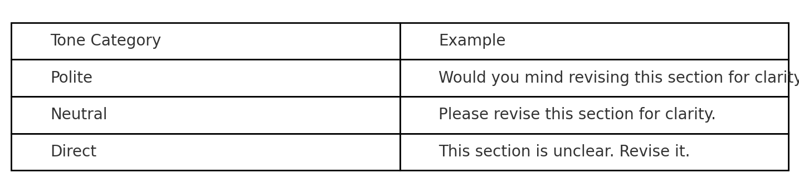

# Tone-Based Prompt Trainer

This project provides a tone-controlled prompt engineering toolkit designed for use with GPT-based LLM systems. It supports multilingual tone analysis and transformation, making it especially useful in education, customer service, and formal communication contexts.

## Features

- Convert sentence tone (e.g., polite vs. direct vs. neutral)
- Ready-to-use prompt templates
- Bilingual documentation (English + Chinese)
- Supports GPT customization (.gpt.json ready)

## Example Prompts

- Rephrase this to sound more formal: "Can you send that over quickly?"
- 用更婉轉的方式表達：「這報告有很多問題。」
- Compare assertive, polite, and neutral tones for the same instruction.

## Applications

- Language education & tone awareness
- Cross-cultural communication design
- LLM-based content moderation or tuning
- Remote-ready instructional design

## Credits

Created by CcXiao  
GitHub: [github.com/Ritchieer](https://github.com/Ritchieer)  
